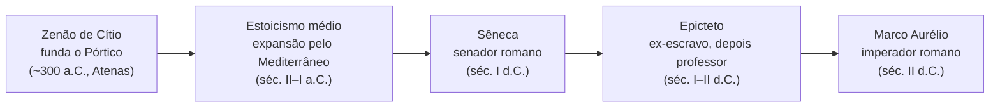
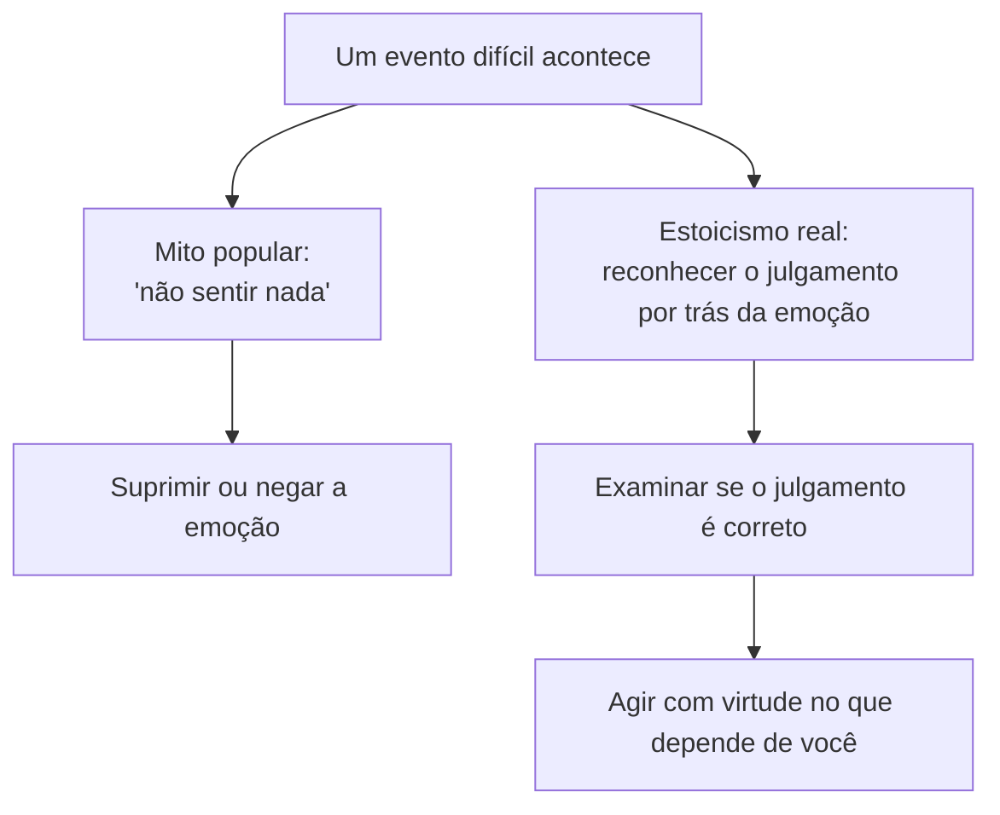

# TOPIC-001 — O que é o estoicismo

## Antes de começar

Nesta aula você vai descobrir o que o estoicismo realmente é — não a versão de rede social que vira sinônimo de "aguentar tudo calado", mas a filosofia grega e depois romana que ensinava a viver bem através da virtude e da razão. Você vai aprender de onde ela veio, qual é sua ideia central, e vai treinar a diferença entre uma afirmação genuinamente estoica e um mito popular sobre o estoicismo. Reserve cerca de 60 minutos. Ao final, você vai produzir sua própria definição do estoicismo e uma pequena análise de afirmações populares sobre o tema.

## Sua sessão de estudo

- [ ] Recuperar o que você já pensa sobre o estoicismo (10 min)
- [ ] Estudar as origens e a ideia central do estoicismo (20 min)
- [ ] Comparar o estoicismo real com o "estoicismo pop" (15 min)
- [ ] Escrever sua própria definição e enviar a avaliação (15 min)

## O que você vai aprender

Ao final desta aula, você vai conseguir:

- explicar o que é o estoicismo com suas próprias palavras;
- situar a escola estoica no tempo, de Atenas a Roma;
- distinguir uma afirmação estoica genuína de um mito popular sobre a filosofia.

## Começando do zero

O **estoicismo** é uma escola de filosofia grega, depois adotada e desenvolvida em Roma, cujo objetivo prático era ensinar como viver bem. Para os estoicos, "viver bem" não significa ter sorte, riqueza ou ausência de problemas — significa viver de acordo com a **virtude**, isto é, com excelência de caráter e de julgamento, guiado pela razão. A ideia central, que você já aplica intuitivamente, é que parte do que acontece com a gente está sob o nosso controle (nossos julgamentos, escolhas e ações) e parte não está (o clima, as ações de outras pessoas, resultados externos). Viver bem, para um estoico, é dedicar toda a energia à primeira parte e aceitar a segunda com serenidade — sem por isso deixar de agir no mundo.

### Vocabulário desta aula

- **Estoicismo:** escola filosófica fundada em Atenas por volta de 300 a.C., que ensina a viver de acordo com a virtude e a razão. Não deve ser confundido com "não sentir nada" ou "não reagir a nada".
- **Virtude:** para os estoicos, a excelência do caráter e do julgamento — a única coisa que é sempre um bem, em qualquer circunstância. É diferente de "ser bem-sucedido" ou "ser rico", que dependem de fatores externos.
- **Dicotomia do controle (introdução):** a distinção entre o que depende de nós (julgamentos, escolhas, ações) e o que não depende (resultados, opinião alheia, o corpo, o passado). Esta aula apresenta a ideia; a Aula 03 vai formalizá-la em detalhe.
- **Pórtico (Stoa):** o pórtico pintado ("Stoa Poikile") em Atenas, onde Zenão de Cítio dava suas aulas por volta de 300 a.C. — é de onde vem o nome "estoicismo".
- **Período helenístico:** o período da história grega entre a morte de Alexandre, o Grande (323 a.C.) e a ascensão de Roma, quando surgiram as principais escolas filosóficas gregas, incluindo o estoicismo.

## Intuição antes dos detalhes

**Analogia:** imagine que você é o capitão de um navio em alto-mar. Você não controla o vento, as ondas ou uma tempestade repentina — isso está fora do seu alcance. Mas você controla como calibra as velas, que rota escolhe traçar e como reage a cada mudança do tempo. Um bom capitão não finge que a tempestade não existe; ele a reconhece plenamente e concentra toda a sua habilidade exatamente no que pode ajustar.

**Onde a analogia ajuda:** ela mostra que a atitude estoica não é passividade — o capitão continua agindo o tempo todo. A virtude estoica é exatamente essa habilidade de navegação: julgar bem e agir bem apesar de circunstâncias que você não escolheu.

**Onde a analogia deixa de funcionar:** um navio pode afundar mesmo com o melhor capitão do mundo — a analogia sugere que o resultado final é o que importa. Para os estoicos, porém, o "sucesso" não é chegar ao porto (um resultado externo, fora do controle total), mas ter navegado com excelência de julgamento. Um estoico que "naufraga" agindo com virtude não fracassou, no sentido que realmente importa para essa filosofia.

## Recupere o que já sabe

Antes de seguir, tente lembrar: em algum momento você já separou intuitivamente "o que dependia de mim" de "o que não dependia de mim" diante de um contratempo — por exemplo, um atraso no trânsito. O que você fez naquela situação foi, na prática, colocar sua atenção no que podia controlar (sua reação, seu planejamento a partir dali) em vez de gastar energia lutando contra o trânsito em si. Guarde esse exemplo: ele vai reaparecer, agora com nome e vocabulário próprios, já na Aula 03.

## Conteúdo essencial

<!-- open-study-path:outcome LO-1 -->
### O que é o estoicismo, em uma frase

Se você precisasse resumir o estoicismo em uma frase, seria algo como: *viva de acordo com a virtude, dedicando sua energia ao que está sob seu controle, e aceite com serenidade — mas sem passividade — o que não está*. Note que há duas partes nessa frase, e as duas importam igualmente: a parte ativa (virtude, ação, julgamento correto) e a parte de aceitação (serenidade diante do que não se controla). Um erro comum é ficar só com a segunda parte e esquecer a primeira — voltamos a isso mais adiante.

### De Atenas a Roma: uma linha do tempo

<!-- open-study-path:outcome LO-2 -->
O estoicismo nasceu por volta de 300 a.C., quando **Zenão de Cítio**, um comerciante que havia perdido sua fortuna num naufrágio, começou a ensinar filosofia sob um pórtico pintado em Atenas — o "Pórtico" ou "Stoa" que dá nome à escola. Esse período inicial é chamado de **estoicismo antigo**. Ao longo dos séculos seguintes, dentro do **período helenístico**, a escola se espalhou e passou por uma fase de "estoicismo médio", até ser adotada com entusiasmo em **Roma**, onde ganhou os autores que vamos estudar na próxima aula: **Sêneca** (um senador e conselheiro imperial, século I d.C.), **Epicteto** (um ex-escravo que se tornou professor de filosofia, final do século I e início do século II d.C.) e **Marco Aurélio** (imperador romano, século II d.C.). É esse **estoicismo romano** — mais prático e menos voltado a debates técnicos de lógica — que é o foco principal desta trilha.

Observe duas coisas nesse mapa: primeiro, o estoicismo não nasceu pronto em Roma — ele tem quase 400 anos de história antes de chegar aos três autores que vamos estudar. Segundo, repare na diversidade social da fase romana: um senador rico, um ex-escravo e um imperador praticaram a mesma filosofia. Isso é incomum na história da filosofia e é uma pista importante de que o estoicismo pretendia ser uma prática acessível a qualquer pessoa, não um privilégio de uma classe social específica — voltaremos a esse ponto na Aula 02. O diagrama simplifica uma história de séculos em cinco marcos; ele não mostra, por exemplo, as diferenças internas entre os estoicos romanos, que a Aula 02 vai detalhar.

### O que o estoicismo não é

<!-- open-study-path:outcome LO-3 -->
Existe uma versão popular do estoicismo — às vezes chamada de "estoicismo de rede social" — que reduz a filosofia a "não demonstrar emoção" ou "aguentar tudo calado". Essa versão é um mito, por dois motivos. Primeiro, os próprios estoicos romanos escreviam constantemente sobre suas dificuldades emocionais reais — Sêneca escreve cartas confessando medo da morte, Marco Aurélio escreve para si mesmo tentando se convencer a não perder a paciência. Reconhecer a emoção é o primeiro passo estoico, não um fracasso. Segundo, "aceitar o que não se controla" nunca significou "não agir": um estoico continua trabalhando, cuidando da saúde, defendendo a justiça e participando da vida pública — a aceitação estoica é sobre o *resultado* final que não depende só de nós, não sobre desistir de agir. Por isso é mais preciso descrever o estoicismo como **aceitação ativa**, e não como **resignação passiva**.

## Mapa visual

O mapa de linha do tempo acima já mostrou a origem histórica do estoicismo. O segundo mapa desta aula ajuda a visualizar a distinção entre a versão popular equivocada e o estoicismo real, que você vai usar constantemente na prática desta aula:

Note que os dois caminhos partem do mesmo ponto (um evento difícil), mas seguem direções opostas: o caminho do mito tenta eliminar a emoção pela força; o caminho real usa a emoção como um sinal para examinar o julgamento por trás dela e, então, agir. O diagrama não detalha *como* examinar um julgamento passo a passo — isso é conteúdo da Aula 05 (Emoções e juízos).

## Exemplos trabalhados

### Exemplo 1 — Um cenário realista de trabalho

**Situação:** Marina está esperando o resultado de uma entrevista de emprego importante, e o processo está demorando mais do que o combinado.

**Mecanismo ou decisão:** Se Marina seguisse o mito popular do estoicismo, ela tentaria simplesmente "não se importar" e reprimir a ansiedade. Seguindo o estoicismo real, ela reconhece a ansiedade, examina o julgamento por trás dela ("isso vai definir se minha vida vai bem ou mal") e nota que esse julgamento é exagerado: o resultado da entrevista está fora do seu controle total, mas sua preparação, sua conduta na entrevista e como ela usa o tempo de espera continuam sob seu controle.

**Consequência:** Ao reformular o julgamento, Marina continua sentindo alguma ansiedade (ela é humana), mas para de perder horas ruminando um resultado que já não pode mudar, e usa o tempo de espera para se preparar para outras oportunidades.

**Forma de verificar:** Ela poderia perguntar a si mesma: "Estou gastando energia em algo que ainda posso influenciar, ou em algo que já está fora das minhas mãos?"

**Limite ou alternativa:** Esse exemplo é um **cenário realista** criado para esta aula, não um caso documentado; ele ilustra o mecanismo, mas cada situação real tem detalhes próprios que merecem atenção específica.

### Exemplo 2 — Um caso histórico real

**Situação:** Em suas *Meditações* (texto que vamos ler diretamente na Aula 07), o imperador romano Marco Aurélio escreve, logo no primeiro parágrafo do Livro II, algo próximo de: hoje vou encontrar pessoas intrometidas, ingratas, arrogantes e desonestas.

**Mecanismo ou decisão:** Em vez de se surpreender ou se indignar quando isso de fato acontece, ele já se prepara antecipadamente, lembrando que o comportamento alheio não está sob seu controle — só sua própria resposta está.

**Consequência:** Essa preparação mental reduz a chance de ele reagir por impulso e o ajuda a manter o julgamento (e, consequentemente, a virtude) mesmo diante de pessoas difíceis.

**Forma de verificar:** Você pode conferir esse trecho diretamente na fonte primária listada nesta aula (Livro II das *Meditações*) — é um caso real e documentado, não um cenário inventado.

**Limite ou alternativa:** Isso não significa esperar o pior de todos sempre; significa apenas não terceirizar sua paz de espírito para o comportamento alheio.

## Erros comuns e como corrigir

- **"Ser estoico é não sentir emoção."** Isso falha porque os próprios estoicos escreviam sobre suas emoções extensivamente. Correção: o objetivo não é eliminar a emoção, mas examinar o julgamento por trás dela.
- **"Estoicismo é aceitar tudo passivamente, sem lutar por nada."** Isso falha porque estoicos romanos ocuparam cargos públicos, defenderam causas e agiram ativamente no mundo. Correção: aceitar o que não se controla não significa parar de agir no que se controla.
- **"Estoicismo é pessimismo — esperar sempre o pior."** Isso falha porque o foco estoico é no julgamento e na virtude, não em prever desfechos ruins por hábito. Correção: preparar-se mentalmente para dificuldades (como no Exemplo 2) é diferente de viver com uma expectativa geral pessimista da vida.

## Prática guiada

Classifique cada afirmação abaixo como **verdadeira**, **parcialmente verdadeira** ou **mito**, e depois confira a pista:

1. "Um estoico nunca chora." *Pista: pense no Exemplo 2 — Marco Aurélio escrevia sobre suas próprias dificuldades emocionais com frequência.*
2. "O estoicismo ensina a focar no que você pode controlar." *Pista: isso está bem alinhado com a dicotomia do controle apresentada nesta aula — mas cuidado para não simplificar demais.*
3. "Estoicismo é uma filosofia só para imperadores e senadores ricos." *Pista: reveja a linha do tempo — quem mais praticou estoicismo romano além de Sêneca e Marco Aurélio?*

Não revele a resposta antes de tentar: escreva sua classificação e sua justificativa antes de comparar com o conteúdo essencial acima.

## Prática independente

Agora, sem consultar as pistas anteriores, escolha **três novas afirmações populares** sobre estoicismo (podem vir de redes sociais, de um livro de autoajuda ou de uma conversa que você já teve) e classifique cada uma como verdadeira, parcialmente verdadeira ou mito, com uma justificativa de duas a três frases para cada uma, usando o vocabulário desta aula (virtude, dicotomia do controle, aceitação ativa).

## Outras formas de aprender

- O artigo do **Daily Stoic** ("What Is Stoicism and How Can It Shape Your Life?") oferece uma introdução acessível e prática, útil como leitura complementar de 10 a 15 minutos, em inglês, de acesso público e gratuito.
- O site da organização **Modern Stoicism** reúne recursos práticos gratuitos, incluindo o programa anual "Stoic Week", útil se você quiser experimentar exercícios guiados além desta trilha.

## Confira sem consultar

1. Sem olhar suas notas, defina o estoicismo em uma frase, incluindo a palavra "virtude".
2. Explique, com suas próprias palavras, por que "não sentir nada" não é o objetivo estoico.
3. Se você errou alguma das perguntas acima, volte apenas ao trecho relacionado ao erro (não a aula inteira) e responda novamente sem consultar.

## O que você vai produzir

Escreva sua própria definição do estoicismo (2 a 4 frases) e a classificação com justificativa das três afirmações populares que você escolheu na prática independente. Não é necessário citar nenhum dado pessoal além do que for relevante para o exercício.

## Avaliação

Abra a avaliação desta etapa diretamente pelo link abaixo:

https://github.com/diegomoura/open-study-path-agent-test-20260826011447/issues/new?template=assessment-topic-001.yml

Depois de enviar suas respostas, volte ao chat e escreva:

`Terminei O que é o estoicismo. Avalie minhas respostas.`

## Como este conteúdo foi construído

A linha do tempo e a definição central desta aula foram construídas a partir da entrada sobre estoicismo da Stanford Encyclopedia of Philosophy e da Internet Encyclopedia of Philosophy, duas referências acadêmicas de acesso público. O mapa da linha do tempo, o mapa do "mito vs. real", a analogia do capitão do navio e o Exemplo 1 (Marina) são adaptações pedagógicas criadas especificamente para esta aula — não são diagramas ou casos relatados nessas fontes. O Exemplo 2 (Marco Aurélio) é um caso real documentado, extraído do início do Livro II das *Meditações*, cuja fonte primária está listada abaixo.

## Fontes e caminhos para aprofundar

| Tipo | Fonte | Como foi usada nesta aula | Acesso |
| --- | --- | --- | --- |
| Acadêmica | Stanford Encyclopedia of Philosophy — "Stoicism" — https://plato.stanford.edu/entries/stoicism/ | Base da linha do tempo e da definição central do estoicismo | público |
| Acadêmica | Internet Encyclopedia of Philosophy — "Stoicism" — https://iep.utm.edu/stoicism/ | Conferência da distinção entre estoicismo antigo, médio e romano | público |
| Primária | Marco Aurélio, "Meditações", Livro II, tradução de George Long — https://classics.mit.edu/Antoninus/meditations.html | Fonte do Exemplo 2 (caso real documentado) | público |
| Explicativa | Daily Stoic — "What Is Stoicism and How Can It Shape Your Life?" — https://dailystoic.com/what-is-stoicism/ | Leitura complementar introdutória | público |
| Prática | Modern Stoicism — https://modernstoicism.com/ | Recursos práticos complementares para quem quiser ir além da trilha | público |
