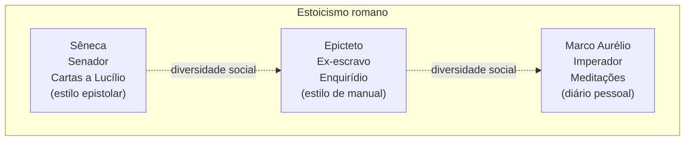

# TOPIC-002 — Os três grandes autores

## Antes de começar

Nesta aula você vai conhecer as três pessoas cujos textos você vai ler diretamente mais adiante na trilha: Sêneca, Epicteto e Marco Aurélio. Você vai descobrir quem cada um foi socialmente, quando viveu, qual obra escreveu e em que estilo — e por que o fato de serem tão diferentes entre si (um senador rico, um ex-escravo, um imperador) é uma pista importante sobre o alcance do estoicismo. Reserve cerca de 60 minutos. Ao final, você vai produzir uma associação autor–obra–contexto e uma justificativa sobre por que essa diversidade social importa.

## Sua sessão de estudo

- [ ] Recuperar a linha do tempo do estoicismo estudada na Aula 01 (10 min)
- [ ] Estudar quem foram Sêneca, Epicteto e Marco Aurélio (20 min)
- [ ] Associar cada autor à sua obra e ao seu estilo (15 min)
- [ ] Justificar por que a diversidade social dos autores importa e enviar a avaliação (15 min)

## O que você vai aprender

Ao final desta aula, você vai conseguir:

- identificar quem foram Sêneca, Epicteto e Marco Aurélio e o papel social de cada um;
- associar cada autor à sua obra principal e ao seu estilo literário;
- explicar por que a diversidade social entre eles importa para o alcance prático do estoicismo.

## Começando do zero

Na Aula 01, você viu que o estoicismo nasceu em Atenas por volta de 300 a.C. e, séculos depois, floresceu em Roma. Esta aula foca exatamente nessa fase romana, através de três pessoas que deixaram textos que sobreviveram até hoje quase completos — o que é raro para a filosofia antiga. Cada um deles escreveu em um momento e em um estilo diferente, e conhecer isso é o que torna possível, mais adiante, ler os originais sabendo exatamente quem fala, de onde e por quê.

### Vocabulário desta aula

- **Sêneca (Lúcio Aneu Sêneca, ~4 a.C.–65 d.C.):** senador romano, dramaturgo e conselheiro do imperador Nero. Escreveu ensaios filosóficos e uma coleção de cartas. Foi condenado a suicídio por ordem de Nero.
- **Epicteto (~50–135 d.C.):** nasceu escravizado na Ásia Menor (atual Turquia), foi levado a Roma, e depois de conquistar a liberdade tornou-se professor de filosofia. Não deixou nada escrito diretamente — suas aulas foram anotadas por um aluno, Arriano.
- **Marco Aurélio (121–180 d.C.):** imperador romano durante quase duas décadas de guerras e uma epidemia. Escreveu um diário filosófico pessoal, nunca destinado à publicação.
- **Cartas a Lucílio:** coleção de cartas filosóficas de Sêneca a um amigo mais jovem, chamado Lucílio — mistura conselho pessoal com argumento filosófico.
- **Enquirídio:** um "manual" curto e direto com os ensinamentos de Epicteto, compilado por Arriano a partir das aulas.
- **Meditações:** o diário pessoal de Marco Aurélio, escrito para si mesmo durante campanhas militares, sem intenção original de ser lido por outras pessoas.

## Intuição antes dos detalhes

**Analogia:** pense nesses três autores como três testemunhas de um mesmo evento, cada uma vista de um ângulo completamente diferente — uma testemunha rica e poderosa, uma que sofreu escravidão, uma que carregava o peso de governar um império. As três descrevem a mesma cena (o estoicismo em prática), mas cada relato tem um ângulo, um vocabulário e uma ênfase próprios, moldados por quem cada uma delas era.

**Onde a analogia ajuda:** ela lembra que ler qualquer um dos três sem saber quem ele era é como ler um depoimento sem saber de onde a testemunha estava olhando — você perde informação sobre por que ela enfatiza certos pontos e não outros.

**Onde a analogia deixa de funcionar:** testemunhas de um evento normalmente descrevem fatos já ocorridos; Sêneca, Epicteto e Marco Aurélio não estavam apenas relatando o estoicismo — estavam ativamente praticando e ensinando enquanto escreviam. A "testemunha" aqui também é parte da própria cena.

## Recupere o que já sabe

Antes de seguir, recupere da Aula 01: o estoicismo nasceu em Atenas com Zenão de Cítio, passou por um período de expansão helenística, e chegou a Roma. É exatamente nesse ponto da linha do tempo — o estoicismo já estabelecido em Roma — que entram os três autores desta aula.

## Conteúdo essencial

### Quem foi cada um deles

<!-- open-study-path:outcome LO-1 -->
**Sêneca** viveu entre aproximadamente 4 a.C. e 65 d.C. Foi senador, um dos homens mais ricos de Roma e, por um período, conselheiro principal do jovem imperador Nero. Escreveu tratados filosóficos (como "Sobre a Ira" e "Sobre a Vida Breve") e, principalmente, as **Cartas a Lucílio** — uma série de cartas filosóficas endereçadas a um amigo mais jovem, misturando conselho prático, reflexão pessoal e argumento filosófico, em estilo elegante e retórico. Sêneca acabou sendo forçado ao suicídio por Nero, sob acusação (provavelmente falsa) de conspiração.

**Epicteto** nasceu escravizado por volta de 50 d.C. na região da atual Turquia, foi levado a Roma como propriedade de um secretário de Nero, e mesmo nessa condição teve acesso a estudos de filosofia. Depois de ganhar a liberdade, fundou sua própria escola. Diferente de Sêneca, Epicteto não escreveu seus próprios textos: um aluno chamado Arriano registrou suas aulas orais, das quais o **Enquirídio** ("manual", em grego) é um resumo direto e prático, quase um guia de bolso.

**Marco Aurélio** foi imperador romano de 161 a 180 d.C., um período marcado por guerras nas fronteiras e por uma grave epidemia em Roma. Ele escreveu as **Meditações** como um diário filosófico pessoal — anotações que ele fazia para si mesmo, muitas vezes durante campanhas militares, tentando se lembrar dos próprios princípios em meio à pressão do poder. Diferente das obras de Sêneca e Epicteto, as Meditações nunca foram escritas pensando em um público leitor.

### Um autor, uma obra, um estilo

<!-- open-study-path:outcome LO-2 -->
A tabela abaixo resume a associação central desta aula:

| Autor | Papel social | Obra principal | Estilo |
| --- | --- | --- | --- |
| Sêneca | Senador e conselheiro imperial | Cartas a Lucílio | Epistolar, retórico, elegante |
| Epicteto | Ex-escravo, depois professor | Enquirídio (registrado por Arriano) | Manual direto, quase didático |
| Marco Aurélio | Imperador | Meditações | Diário pessoal, introspectivo |

### Por que essa diversidade social importa

<!-- open-study-path:outcome LO-3 -->
É incomum, na história da filosofia antiga, que a mesma escola de pensamento seja praticada com igual seriedade por um senador rico, um ex-escravo e um imperador. Essa diversidade é uma evidência prática de que o estoicismo não pretendia ser um privilégio de uma classe específica — ele se apresentava como um caminho aberto a qualquer condição de vida, porque seu foco (a virtude e o que depende de nós) é, em princípio, igualmente acessível a um senador e a um escravo. Isso não significa que a experiência de vida de cada um fosse igual — claramente não era —, mas que o estoicismo oferecia o mesmo tipo de ferramenta interior independentemente da posição social.

## Mapa visual

O mapa abaixo organiza os três autores lado a lado, destacando a diferença de papel social e de estilo, para você visualizar de uma vez a comparação que acabou de estudar:

Note que o diagrama não indica uma ordem cronológica estrita de leitura nem uma hierarquia entre os autores — as três colunas são paralelas de propósito, para reforçar visualmente que nenhuma delas é "mais estoica" que as outras apesar das diferenças de posição social. O diagrama também não mostra as diferenças filosóficas sutis entre os três, que aparecerão quando você ler os textos originais na Aula 07.

## Exemplos trabalhados

### Exemplo 1 — Reconhecendo o estilo pelo trecho

**Situação:** você recebe três trechos sem indicação de autor: (a) uma carta pessoal aconselhando um amigo sobre como usar bem o tempo; (b) um conjunto curto e direto de regras práticas sobre o que está e o que não está sob nosso controle; (c) uma frase introspectiva, escrita na primeira pessoa, sobre se preparar para encontrar pessoas difíceis ao longo do dia.

**Mecanismo ou decisão:** usando o vocabulário desta aula, você reconhece que (a) tem formato de carta e tom de conselho pessoal — provavelmente Sêneca; (b) tem formato de regras diretas e objetivas — provavelmente o Enquirídio de Epicteto; (c) tem tom de anotação pessoal, escrita para o próprio autor se lembrar de algo — provavelmente as Meditações de Marco Aurélio.

**Consequência:** ao reconhecer o estilo, você já chega à leitura do trecho completo (na Aula 07) sabendo o que esperar e por que o texto tem aquela forma.

**Forma de verificar:** cheque se a pista contextual bate com o papel social do autor (por exemplo, o tom de "manual prático e direto" combina com o estilo de ensino do Enquirídio).

**Limite ou alternativa:** este é um **cenário realista** criado para praticar reconhecimento de estilo; os trechos completos e reais serão estudados com cuidado na Aula 07.

### Exemplo 2 — Um caso histórico real

**Situação:** Sêneca foi acusado (provavelmente de forma injusta) de participar de uma conspiração contra o imperador Nero, seu ex-aluno.

**Mecanismo ou decisão:** Nero ordenou que Sêneca se suicidasse — uma prática romana que permitia a um acusado de alto status "escolher" a própria morte em vez de ser executado publicamente. Segundo relatos históricos (como os de Tácito), Sêneca teria enfrentado a situação com a serenidade que ele mesmo defendia em seus escritos.

**Consequência:** esse episódio é frequentemente citado como um teste real da coerência entre o que Sêneca escrevia e como ele viveu (e morreu) — embora estudiosos debatam o quanto o relato foi embelezado por historiadores posteriores.

**Forma de verificar:** você pode conferir a entrada da Internet Encyclopedia of Philosophy sobre Sêneca, listada nas fontes desta aula, que resume o contexto biográfico e essa morte.

**Limite ou alternativa:** este é um **caso real documentado**, mas com incerteza histórica sobre detalhes exatos — diferente do Exemplo 1, que é um cenário criado apenas para praticar reconhecimento de estilo.

## Erros comuns e como corrigir

- **"Epicteto escreveu o Enquirídio."** Isso é impreciso: Epicteto ensinava oralmente; foi seu aluno Arriano quem registrou e organizou o material por escrito. Correção: trate o Enquirídio como um registro de aulas, não uma autobiografia escrita pelo próprio Epicteto.
- **"Marco Aurélio escreveu as Meditações para ensinar o povo romano."** Isso falha porque as Meditações eram anotações pessoais, sem intenção de publicação. Correção: leia o texto como um diário íntimo, não como um discurso público.
- **"Só gente rica e poderosa praticava estoicismo em Roma."** Isso ignora Epicteto. Correção: use a diversidade social dos três autores como evidência direta contra essa generalização.

## Prática guiada

Associe cada afirmação a um dos três autores, com uma pista disponível caso precise:

1. "Fui escravizado antes de me tornar professor de filosofia." *Pista: pense em quem teve essa trajetória de vida específica.*
2. "Escrevi cartas filosóficas a um amigo mais jovem." *Pista: qual obra tem formato de correspondência?*
3. "Escrevi para mim mesmo, durante campanhas militares, sem pensar em publicar." *Pista: qual autor tinha responsabilidades de governo e guerra?*

Tente responder antes de olhar as pistas; depois confira com o conteúdo essencial acima.

## Prática independente

Monte uma tabela (ou texto equivalente) com os três autores, incluindo: papel social, obra principal, estilo literário e uma frase justificando por que a diversidade social entre eles é relevante para entender o alcance prático do estoicismo. Não copie a tabela desta aula: escreva com suas próprias palavras e, se possível, acrescente um detalhe biográfico que não foi mencionado aqui (você pode consultar as fontes complementares).

## Outras formas de aprender

- As entradas da **Internet Encyclopedia of Philosophy** sobre Sêneca, Epicteto e Marco Aurélio (listadas nas fontes) oferecem biografias mais detalhadas do que esta aula, com foco acadêmico, de acesso público e gratuito.

## Confira sem consultar

1. Sem olhar suas notas, diga o papel social de cada um dos três autores (Sêneca, Epicteto, Marco Aurélio).
2. Explique, com suas próprias palavras, por que a diversidade social entre eles é uma pista importante sobre o alcance do estoicismo.
3. Se você errou alguma associação, volte apenas ao trecho relacionado ao autor específico (não a aula inteira) e responda novamente sem consultar.

## O que você vai produzir

Uma tabela ou texto associando cada autor à sua obra principal, papel social e estilo, com uma justificativa de por que a diversidade social importa — no formato descrito na prática independente.

## Avaliação

Abra a avaliação desta etapa diretamente pelo link abaixo:

https://github.com/diegomoura/open-study-path-agent-test-20260826011447/issues/new?template=assessment-topic-002.yml

Depois de enviar suas respostas, volte ao chat e escreva:

`Terminei Os três grandes autores. Avalie minhas respostas.`

## Como este conteúdo foi construído

Os dados biográficos e o resumo de obra/estilo desta aula foram construídos a partir das entradas da Internet Encyclopedia of Philosophy sobre Sêneca, Epicteto e Marco Aurélio, e conferidos com os textos primários listados (Cartas a Lucílio, Enquirídio e Meditações). A tabela comparativa, o mapa visual, a analogia das "três testemunhas" e o Exemplo 1 (reconhecimento de estilo) são adaptações pedagógicas criadas para esta aula. O Exemplo 2 (a morte de Sêneca) é um caso real documentado, com a ressalva histórica de que os relatos antigos sobre esse episódio podem ter sido dramatizados por historiadores posteriores.

## Fontes e caminhos para aprofundar

| Tipo | Fonte | Como foi usada nesta aula | Acesso |
| --- | --- | --- | --- |
| Primária | Sêneca, "Cartas a Lucílio", Carta 1, tradução de Richard M. Gummere — https://en.wikisource.org/wiki/Moral_letters_to_Lucilius/Letter_1 | Exemplo do estilo epistolar de Sêneca | público |
| Primária | Epicteto, "Enquirídio", tradução de Elizabeth Carter — https://classics.mit.edu/Epictetus/epicench.html | Exemplo do estilo de manual de Epicteto | público |
| Primária | Marco Aurélio, "Meditações", Livro II, tradução de George Long — https://classics.mit.edu/Antoninus/meditations.html | Exemplo do estilo de diário pessoal | público |
| Acadêmica | Internet Encyclopedia of Philosophy — "Seneca" — https://iep.utm.edu/seneca/ | Base biográfica e contexto da morte de Sêneca | público |
| Acadêmica | Internet Encyclopedia of Philosophy — "Epictetus" — https://iep.utm.edu/epictetu/ | Base biográfica de Epicteto | público |
| Acadêmica | Internet Encyclopedia of Philosophy — "Marcus Aurelius" — https://iep.utm.edu/marcus-a/ | Base biográfica de Marco Aurélio | público |
