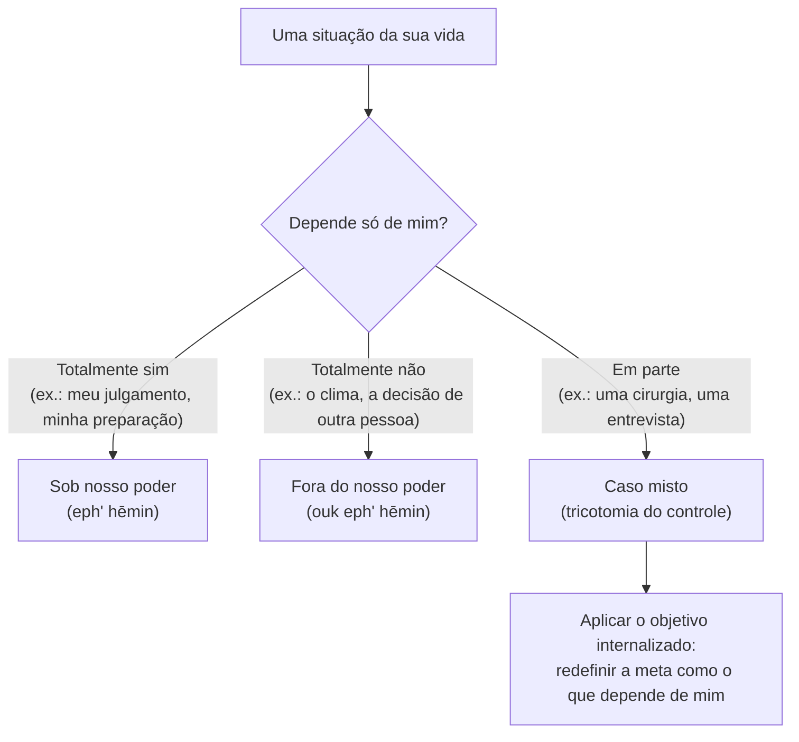
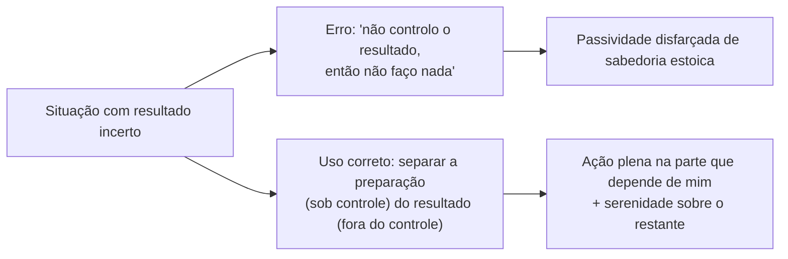

# TOPIC-003 — A dicotomia do controle

## Antes de começar

Você já usa a dicotomia do controle intuitivamente — você mesmo aplicou essa ideia a um atraso no trânsito, focando no que podia fazer a seguir em vez de lutar contra o trânsito em si. Nesta aula, essa intuição ganha nome, vocabulário preciso e uma ferramenta para os casos difíceis: as situações ambíguas, em que parte de algo está sob seu controle e parte não está. Reserve cerca de 75 minutos. Ao final, você vai classificar situações reais (incluindo pelo menos uma ambígua) e reescrever reações a adversidades usando o vocabulário da aula.

## Sua sessão de estudo

- [ ] Recuperar a dicotomia intuitiva que você já usa (10 min)
- [ ] Estudar a dicotomia formal com o vocabulário de Epicteto (20 min)
- [ ] Praticar a classificação de casos ambíguos com a tricotomia do controle (20 min)
- [ ] Reescrever reações a adversidades reais e enviar a avaliação (20 min)

## O que você vai aprender

Ao final desta aula, você vai conseguir:

- formalizar a dicotomia do controle com o vocabulário original de Epicteto;
- reconhecer e decompor casos ambíguos ou parcialmente controláveis;
- aplicar a dicotomia para reformular reações a adversidades reais, sem transformá-la em desculpa para não agir.

## Começando do zero

Na Aula 01, você viu que o estoicismo pede que a gente concentre energia no que está sob nosso controle e aceite com serenidade o que não está. Esta aula pega essa ideia central e a transforma em uma ferramenta de trabalho, com o vocabulário que o próprio Epicteto usou para ensiná-la, quase 2.000 anos atrás, no início do seu manual de ensino, o *Enquirídio*.

### Vocabulário desta aula

- **Dicotomia do controle (formal):** a divisão entre o que está "sob nosso poder" (em grego, *eph' hēmin*) e o que não está (*ouk eph' hēmin*), como Epicteto escreve logo na primeira frase do Enquirídio.
- **Prohairesis:** termo usado por estudiosos de Epicteto para descrever a faculdade de julgamento e escolha racional — o núcleo daquilo que está sempre, sem exceção, sob nosso poder. Mesmo quando tudo o mais é tirado de alguém (liberdade, corpo, bens), a prohairesis permanece intacta.
- **Caso misto (ou ambíguo):** uma situação que combina uma parte sob nosso controle (por exemplo, nossa preparação) com uma parte fora dele (por exemplo, a decisão de outra pessoa ou um evento aleatório).
- **Tricotomia do controle:** um refinamento popular da dicotomia original, usado por autores contemporâneos como William B. Irvine, que separa três grupos: coisas totalmente sob nosso controle, coisas totalmente fora dele, e coisas parcialmente sob nosso controle — os casos mistos.
- **Objetivo internalizado:** a técnica de reformular uma meta que depende de fatores externos (por exemplo, "vencer o processo seletivo") em uma meta que depende só de você (por exemplo, "me preparar e me apresentar da melhor forma possível").

## Intuição antes dos detalhes

**Analogia:** pense em um jogo de cartas. Você não escolhe quais cartas recebe — isso está fora do seu controle. Mas você escolhe como joga a mão que recebeu: quando arriscar, quando recuar, que estratégia seguir.

**Onde a analogia ajuda:** ela separa bem duas coisas que costumamos misturar — o que "aconteceu com você" (as cartas) e o que "você faz com isso" (a jogada). Um jogador habilidoso pode jogar muito bem uma mão ruim, mesmo sem vencer a partida.

**Onde a analogia deixa de funcionar:** em um jogo de cartas, existe uma "vitória" clara e o objetivo declarado é ganhar. Para os estoicos, o objetivo não é "vencer" no sentido de garantir um resultado externo (isso normalmente não está 100% sob seu controle) — é jogar com virtude, qualquer que seja o resultado. Se você levar a analogia longe demais, pode achar que o ponto da dicotomia é "jogar bem para ganhar", quando na verdade é "jogar bem porque é isso que está ao seu alcance".

## Recupere o que já sabe

Volte ao exemplo do atraso no trânsito, que você já usou antes de começar esta trilha. Você não escolheu o trânsito (fora do seu controle), mas escolheu sua reação e seu replanejamento (sob seu controle). Essa mesma estrutura — eventos externos de um lado, julgamento e ação do outro — é exatamente o que Epicteto formaliza a seguir, só que com um vocabulário mais preciso e com atenção especial aos casos que não são tão claros quanto um engarrafamento.

## Conteúdo essencial

### O que está sob nosso poder — e o que não está

<!-- open-study-path:outcome LO-1 -->
Epicteto abre o *Enquirídio* com uma frase que resume toda a dicotomia: algumas coisas estão sob nosso poder, e outras não. Sob nosso poder (*eph' hēmin*) estão o julgamento, o impulso, o desejo, a aversão — em resumo, tudo que é "obra nossa", tudo que passa pela nossa **prohairesis**, nossa faculdade de julgar e escolher. Fora do nosso poder (*ouk eph' hēmin*) estão o corpo, a propriedade, a reputação, o cargo que ocupamos — em resumo, tudo que não é obra nossa, mesmo que pareça muito "nosso" (seu próprio corpo, por exemplo, pode adoecer ou ser ferido sem que você tenha escolhido isso).

Note a diferença em relação à Aula 01: lá, a dicotomia apareceu de forma introdutória, ligada a julgamentos, escolhas e ações. Aqui, ela ganha o vocabulário técnico (*eph' hēmin* / *ouk eph' hēmin*) e um núcleo bem definido — a prohairesis —, que é o que resta sempre disponível a você, mesmo nas piores circunstâncias.

### Casos que parecem simples, mas não são

<!-- open-study-path:outcome LO-2 -->
A dicotomia original de Epicteto é uma divisão em duas categorias, mas a vida raramente se encaixa perfeitamente em uma delas. Considere se preparar para uma cirurgia: sua preparação (seguir as orientações médicas, chegar descansado, fazer as perguntas certas ao médico) está sob seu controle; o resultado biológico da cirurgia em si não está. Esse é um **caso misto**.

O filósofo contemporâneo William B. Irvine descreve esse tipo de situação através do que chama de **tricotomia do controle**: em vez de duas categorias, ele propõe três — coisas totalmente sob nosso controle (nossos próprios julgamentos e metas internas), coisas totalmente fora do nosso controle (o clima, a decisão de outra pessoa) e coisas **parcialmente** sob nosso controle, como jogar uma partida de tênis ou fazer uma cirurgia, em que sua ação influencia o resultado sem garanti-lo.

A ferramenta prática de Irvine para lidar com casos mistos é o **objetivo internalizado**: em vez de definir sua meta como o resultado externo ("ganhar o processo seletivo", "sair bem da cirurgia"), você a redefine como aquilo que está inteiramente sob seu controle ("me preparar e me apresentar da melhor forma possível", "seguir todas as orientações médicas com cuidado"). Isso não muda o que vai acontecer no mundo — muda onde você coloca sua expectativa e seu julgamento de sucesso.

### Usar a dicotomia sem virar desculpa para não agir

<!-- open-study-path:outcome LO-3 -->
Existe um mau uso comum da dicotomia: "já que não controlo totalmente o resultado, não faz sentido nem tentar". Isso inverte a lógica de Epicteto. A preparação, o esforço, a ação — tudo isso é *eph' hēmin*, está sob seu poder, mesmo quando o resultado final não está. Tratar um caso misto como se fosse "totalmente fora do controle" é um erro tão grave quanto tratar algo totalmente fora do controle como se dependesse só de você. A dicotomia não existe para justificar a passividade; existe para apontar exatamente onde vale a pena investir esforço e onde vale a pena investir serenidade.

## Mapa visual

O primeiro mapa organiza as três categorias que você acabou de estudar, com um exemplo de cada uma:

Repare que o caso misto (E) não é resolvido "escolhendo um lado": ele recebe um tratamento próprio, o objetivo internalizado, que é o conteúdo mais novo desta aula em relação à Aula 01.

O segundo mapa mostra o erro de mau uso da dicotomia e como corrigi-lo:

O diagrama não cobre todos os graus possíveis de incerteza de uma situação — ele mostra o padrão geral do erro e da correção, que você vai aplicar a casos concretos na prática desta aula.

## Exemplos trabalhados

### Exemplo 1 — Um cenário realista de entrevista de emprego

**Situação:** Rafael tem uma entrevista de emprego importante marcada para a próxima semana.

**Mecanismo ou decisão:** Se Rafael definir sua meta como "conseguir a vaga", ele está mirando em algo parcialmente fora do seu controle — a decisão final depende também do entrevistador, de outros candidatos e de fatores que ele nem conhece. Usando o objetivo internalizado, Rafael redefine sua meta: "me preparar profundamente sobre a empresa, praticar respostas para perguntas prováveis e me apresentar com clareza". Essa meta está inteiramente sob seu controle.

**Consequência:** Rafael continua investindo esforço real na entrevista (a dicotomia não vira desculpa para relaxar), mas sua ansiedade fica ligada a algo que ele realmente pode garantir, não ao resultado final.

**Forma de verificar:** Depois da entrevista, ele pode perguntar: "eu me preparei e me apresentei da melhor forma que pude?" — essa pergunta tem resposta sob seu controle, diferente de "eu consegui a vaga?".

**Limite ou alternativa:** Este é um **cenário realista** criado para esta aula; ele ilustra o mecanismo do objetivo internalizado, mas cada processo seletivo real tem variáveis próprias.

### Exemplo 2 — Um caso real documentado

**Situação:** Epicteto viveu boa parte da vida com uma deficiência física — segundo relatos biográficos antigos, uma perna manca, possivelmente resultado de maus-tratos durante o período em que foi escravizado.

**Mecanismo ou decisão:** O corpo de Epicteto — sua saúde, sua mobilidade — é exatamente o tipo de coisa que a dicotomia classifica como *ouk eph' hēmin*, fora do nosso poder. O que permaneceu sob seu poder foi sua prohairesis: sua capacidade de julgar, ensinar e viver de acordo com a virtude, independentemente da condição do corpo.

**Consequência:** Epicteto se tornou um dos professores de filosofia mais influentes de Roma precisamente ensinando essa distinção a partir da própria experiência: seu corpo foi limitado por outros, mas seu julgamento nunca deixou de ser seu.

**Forma de verificar:** Você pode conferir esse detalhe biográfico na entrada da Internet Encyclopedia of Philosophy sobre Epicteto, listada nas fontes desta aula.

**Limite ou alternativa:** Este é um **caso real documentado**, mas com incerteza histórica sobre os detalhes exatos de como e quando a lesão ocorreu — fontes antigas divergem em detalhes, embora concordem na existência da deficiência.

## Erros comuns e como corrigir

- **"Já que não controlo o resultado, não faz sentido nem tentar."** Isso falha porque confunde o resultado (fora do controle) com a preparação e a ação (sob controle). Correção: separe as duas partes e invista esforço pleno na parte que depende de você.
- **"Tudo que envolve outras pessoas está completamente fora do meu controle."** Isso falha porque suas próprias palavras, ações e intenções em relação a outra pessoa continuam sendo *eph' hēmin* — só a reação dela é que não está sob seu poder. Correção: distinga sua ação (controlável) da reação alheia (não controlável).
- **"Todo caso é totalmente controlável ou totalmente incontrolável."** Isso falha porque ignora os casos mistos, que são a maioria das situações importantes da vida real (saúde, carreira, relacionamentos). Correção: use a tricotomia do controle e o objetivo internalizado para tratar esses casos com precisão, em vez de forçá-los em uma das duas categorias extremas.

## Prática guiada

Classifique cada situação como **sob controle**, **fora de controle** ou **caso misto**, e depois confira a pista:

1. "O resultado de um exame médico que você já fez." *Pista: pense no que já aconteceu no seu corpo versus o que você ainda pode fazer com a informação do exame.*
2. "Como você reage à notícia de um exame médico." *Pista: isso é sobre julgamento e ação, não sobre o próprio evento.*
3. "Ser aprovado em uma entrevista de emprego para a qual você se preparou muito bem." *Pista: separe sua preparação do critério de decisão do entrevistador.*

Não revele a resposta antes de tentar: escreva sua classificação e justificativa antes de comparar com o conteúdo essencial acima.

## Prática independente

Escolha **três situações reais da sua vida** (passadas ou atuais), incluindo **pelo menos um caso misto/ambíguo**. Para cada uma: (1) classifique como sob controle, fora de controle ou caso misto; (2) se for um caso misto, escreva o "objetivo internalizado" correspondente; (3) reescreva sua reação (real ou planejada) usando o vocabulário desta aula (*eph' hēmin* / *ouk eph' hēmin*, prohairesis, aceitação ativa).

## Outras formas de aprender

- O capítulo sobre a dicotomia do controle em *A Guide to the Good Life: The Ancient Art of Stoic Joy*, de William B. Irvine, aprofunda a tricotomia do controle e o objetivo internalizado com vários exemplos contemporâneos — obra de acesso pago ou por biblioteca.
- O índice de Discursos de Epicteto no MIT Classics Archive permite ler diretamente outros trechos em que Epicteto aplica a dicotomia a situações de risco pessoal, como processos judiciais.

## Confira sem consultar

1. Sem olhar suas notas, explique a diferença entre *eph' hēmin* e *ouk eph' hēmin* com um exemplo de cada.
2. Explique, com suas próprias palavras, o que é um "caso misto" e o que é o "objetivo internalizado".
3. Se você errou alguma das perguntas acima, volte apenas ao trecho relacionado ao erro (não a aula inteira) e responda novamente sem consultar.

## O que você vai produzir

A classificação e a reescrita de três situações reais (com pelo menos um caso misto), incluindo o objetivo internalizado do caso misto, no formato descrito na prática independente.

## Avaliação

Abra a avaliação desta etapa diretamente pelo link abaixo:

https://github.com/diegomoura/open-study-path-agent-test-20260826011447/issues/new?template=assessment-topic-003.yml

Depois de enviar suas respostas, volte ao chat e escreva:

`Terminei A dicotomia do controle. Avalie minhas respostas.`

## Como este conteúdo foi construído

A definição formal da dicotomia (*eph' hēmin* / *ouk eph' hēmin*) foi construída a partir do primeiro capítulo do Enquirídio de Epicteto e conferida na entrada da Stanford Encyclopedia of Philosophy sobre Epicteto. A tricotomia do controle e o objetivo internalizado são conceitos de William B. Irvine, usados aqui como refinamento pedagógico moderno da dicotomia original — não são termos do próprio Epicteto. A analogia do jogo de cartas, os dois mapas visuais e o Exemplo 1 (Rafael) são adaptações pedagógicas criadas especificamente para esta aula. O Exemplo 2 (a deficiência física de Epicteto) é um caso real documentado, com a ressalva histórica de que fontes antigas divergem em detalhes sobre sua origem exata.

## Fontes e caminhos para aprofundar

| Tipo | Fonte | Como foi usada nesta aula | Acesso |
| --- | --- | --- | --- |
| Primária | Epicteto, "Enquirídio", Capítulo 1, tradução de Elizabeth Carter — https://classics.mit.edu/Epictetus/epicench.html | Base textual da dicotomia original (*eph' hēmin* / *ouk eph' hēmin*) | público |
| Primária | Epicteto, "Discursos" (índice), tradução de George Long — https://classics.mit.edu/Epictetus/discourses.html | Leitura complementar de aplicações da dicotomia a situações de risco pessoal | público |
| Acadêmica | Stanford Encyclopedia of Philosophy — "Epictetus" — https://plato.stanford.edu/entries/epictetus/ | Conferência da distinção conceitual e do papel da prohairesis | público |
| Acadêmica | Internet Encyclopedia of Philosophy — "Epictetus" — https://iep.utm.edu/epictetu/ | Base biográfica do Exemplo 2 (deficiência física de Epicteto) | público |
| Explicativa | William B. Irvine, "A Guide to the Good Life: The Ancient Art of Stoic Joy" (Oxford University Press, 2008), capítulo sobre a dicotomia do controle | Fonte da tricotomia do controle e do objetivo internalizado | biblioteca / pago |
