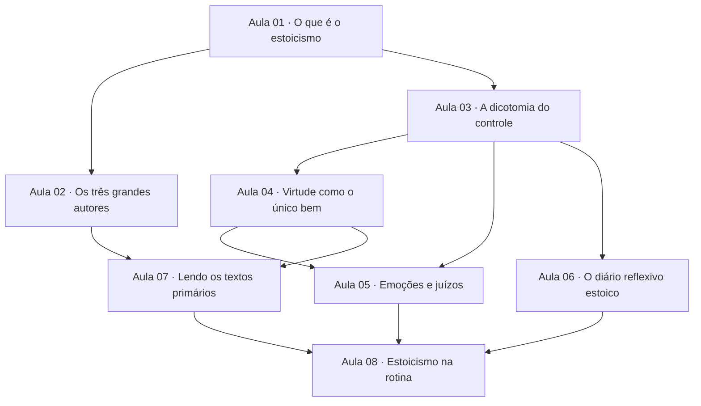

# Trilha de estudos — Estoicismo

Esta é a proposta de arquitetura da sua trilha. Ela mostra **o que você vai aprender**, **em que ordem** e **por que cada etapa importa** para o seu objetivo: entender o pensamento original dos estoicos e aplicar práticas como a dicotomia do controle e o diário reflexivo na sua rotina.

Nesta etapa nada foi materializado ainda: as aulas detalhadas, os exercícios e as avaliações são criados depois, quando você pedir para gerar a trilha. Aqui você aprova o mapa.

## Seu ponto de partida

Você chega sem estudo formal de filosofia e sem leitura dos textos originais, mas já tem uma intuição correta sobre a ideia central do estoicismo: separar o que está sob o seu controle do que não está. Você aplicou essa ideia bem a uma situação real (um atraso no trânsito).

Por isso, a trilha **não** vai reensinar essa intuição do zero. Em vez disso, ela começa dando contexto (o que é o estoicismo, de onde veio, quem foram os autores) e depois formaliza e aprofunda a dicotomia do controle, conectando-a ao restante do sistema estoico. O foco recai sobre o que você ainda não tem: vocabulário, o pensamento original dos textos e prática estruturada.

Alguns termos aparecem no mapa abaixo. Para não deixar nada sem explicação, aqui vão as definições curtas dos principais:

- **Dicotomia do controle** — a distinção entre o que depende de você (juízos, escolhas, ações) e o que não depende (resultados, opinião alheia, o corpo, o passado).
- **Quatro virtudes cardeais** — sabedoria, coragem, justiça e temperança; para os estoicos, a virtude é o único bem verdadeiro.
- **Diário reflexivo estoico** — a prática de revisar por escrito o próprio dia à luz dos princípios, no espírito das *Meditações* de Marco Aurélio.
- **Textos primários** — as obras originais dos próprios estoicos (Sêneca, Epicteto, Marco Aurélio), em vez de resumos ou citações soltas.

## Como ler este mapa

A trilha é organizada por **aulas** (unidades de aprendizagem coerentes), não por semanas. Cada aula tem um número que ajuda a navegar, mas **a ordem real de liberação vem dos pré-requisitos diretos**, não do número. Quando uma aula tem vários pré-requisitos, todos precisam estar concluídos antes de ela ficar pronta.

## Diagrama de dependências

### Como o mapa funciona

- **Raiz:** a **Aula 01** é o único ponto de entrada. Tudo parte da compreensão do que é o estoicismo.
- **Duas frentes cedo:** logo depois, a **Aula 02** (autores e contexto histórico) e a **Aula 03** (dicotomia do controle) podem ser estudadas em paralelo, porque ambas dependem apenas da Aula 01. Uma é mais histórica, a outra é o primeiro conceito prático.
- **Núcleo conceitual:** a partir da Aula 03, você constrói o coração da ética estoica — virtude como único bem (Aula 04) e a teoria estoica das emoções (Aula 05).
- **Prática estruturada:** o diário reflexivo (Aula 06) depende da dicotomia do controle (Aula 03), porque é sobre ela que a reflexão diária se apoia.
- **Leitura dos originais:** a Aula 07 (ler os textos primários) reúne o contexto dos autores (Aula 02) e a base conceitual (Aulas 03 e 04), para que você leia Sêneca, Epicteto e Marco Aurélio com um mapa mental, não no vácuo.
- **Convergência final:** a **Aula 08** integra emoções (Aula 05), prática de diário (Aula 06) e leitura dos originais (Aula 07) num plano estoico aplicado à sua rotina. É a aula que entrega o seu objetivo declarado.

## As aulas

### Aula 01 · O que é o estoicismo
- **ID interno:** TOPIC-001
- **Pré-requisitos diretos:** nenhum (ponto de entrada)
- **Capacidade:** explicar, em linguagem própria, o que é o estoicismo, quando e onde surgiu, e o que o distingue de um "aguentar calado" ou de puro pessimismo.
- **Por que importa para você:** você chega sem contexto formal; começar pela identidade da filosofia evita confundir o estoicismo popular das redes sociais com o pensamento original que você quer entender.
- **Evidência esperada:** um exercício em que você define o estoicismo com suas palavras e distingue afirmações estoicas de mitos comuns sobre a filosofia.
- **Esforço estimado:** ~60 min.

### Aula 02 · Os três grandes autores
- **ID interno:** TOPIC-002
- **Pré-requisitos diretos:** Aula 01.
- **Capacidade:** situar Sêneca, Epicteto e Marco Aurélio no tempo, identificar quem cada um foi (senador, ex-escravo, imperador) e reconhecer a obra e o estilo de cada um.
- **Por que importa para você:** você já reconhece o nome "Meditações" de Marco Aurélio, mas não conhece Sêneca nem Epicteto; conhecer quem escreveu o quê é o que torna a leitura dos originais possível mais adiante.
- **Evidência esperada:** um exercício de associação e justificativa ligando autor, obra, contexto de vida e o tema pelo qual cada um é mais lembrado.
- **Esforço estimado:** ~60 min.

### Aula 03 · A dicotomia do controle
- **ID interno:** TOPIC-003
- **Pré-requisitos diretos:** Aula 01.
- **Capacidade:** formalizar a distinção entre o que depende de nós e o que não depende, reconhecer casos ambíguos e usar a dicotomia para reformular reações a adversidades.
- **Por que importa para você:** esta é a prática que você já pediu explicitamente e sobre a qual já tem boa intuição; aqui ela deixa de ser intuição e vira ferramenta precisa, com vocabulário de Epicteto.
- **Evidência esperada:** exercícios aplicados em que você classifica situações reais e reescreve reações à luz da dicotomia, incluindo pelo menos um caso ambíguo.
- **Esforço estimado:** ~75 min.

### Aula 04 · Virtude como o único bem
- **ID interno:** TOPIC-004
- **Pré-requisitos diretos:** Aula 03.
- **Capacidade:** explicar as quatro virtudes cardeais (sabedoria, coragem, justiça, temperança), a ideia de que só a virtude é bem, e a diferença entre "bem", "mal" e "indiferentes preferíveis".
- **Por que importa para você:** sem esse pilar, o estoicismo vira só "controle emocional"; ele é o que dá sentido ético às decisões que você quer tomar com mais clareza.
- **Evidência esperada:** um exercício que analisa dilemas cotidianos usando as virtudes e a categoria dos "indiferentes".
- **Esforço estimado:** ~75 min.

### Aula 05 · Emoções e juízos
- **ID interno:** TOPIC-005
- **Pré-requisitos diretos:** Aula 03 e Aula 04.
- **Capacidade:** explicar a teoria estoica das emoções (as paixões nascem de juízos, não dos fatos), distinguir emoção de reação impulsiva e identificar juízos automáticos numa situação.
- **Por que importa para você:** este é o mecanismo por trás de "lidar melhor com adversidades"; depende da dicotomia (Aula 03) e da noção de bem (Aula 04) para não virar mera repressão de sentimentos.
- **Evidência esperada:** exercícios em que você mapeia a cadeia fato → juízo → emoção → resposta em situações reais e propõe reformulações.
- **Esforço estimado:** ~75 min.

### Aula 06 · O diário reflexivo estoico
- **ID interno:** TOPIC-006
- **Pré-requisitos diretos:** Aula 03.
- **Capacidade:** conduzir uma prática de escrita reflexiva no espírito das *Meditações*, com revisão do dia (manhã e noite) ancorada na dicotomia do controle.
- **Por que importa para você:** você pediu explicitamente o diário reflexivo como prática de rotina; ele se apoia na dicotomia (Aula 03), por isso vem logo depois dela e pode andar em paralelo às Aulas 04 e 05.
- **Evidência esperada:** registros de diário de alguns dias, seguindo um roteiro estoico, com uma breve autoanálise do que a prática revelou.
- **Esforço estimado:** ~60 min (mais a prática distribuída ao longo de alguns dias).

### Aula 07 · Lendo os textos primários
- **ID interno:** TOPIC-007
- **Pré-requisitos diretos:** Aula 02 e Aula 04.
- **Capacidade:** ler trechos originais de Sêneca (*Cartas a Lucílio*), Epicteto (*Enquirídio*) e Marco Aurélio (*Meditações*) e interpretá-los com o vocabulário estoico, distinguindo o texto do comentário.
- **Por que importa para você:** este é o coração do seu pedido — "entender o pensamento original, não só resumos"; depende de conhecer os autores (Aula 02) e ter a base conceitual (Aulas 03 e 04) para ler com autonomia.
- **Evidência esperada:** uma leitura guiada e comentada de trechos curtos, em que você explica o argumento do autor e o relaciona aos conceitos já estudados.
- **Esforço estimado:** ~90 min.

### Aula 08 · Estoicismo na rotina
- **ID interno:** TOPIC-008
- **Pré-requisitos diretos:** Aula 05, Aula 06 e Aula 07.
- **Capacidade:** montar e sustentar um plano estoico pessoal que combina reflexão sobre emoções, prática de diário e leitura contínua dos originais, aplicado às suas próprias adversidades e decisões.
- **Por que importa para você:** é a aula que reúne tudo e entrega o seu objetivo final — aplicar o estoicismo no dia a dia, com clareza de decisão e disciplina emocional, sem depender de resumos.
- **Evidência esperada:** um plano pessoal documentado (práticas, gatilhos, revisões) com relato de aplicação em situações reais da sua rotina, avaliado pelos critérios das aulas anteriores.
- **Esforço estimado:** ~90 min (mais a aplicação continuada).

## Esforço total

A trilha tem **8 aulas** com um esforço estimado de **cerca de 9 a 10 horas de estudo dirigido**, além da prática distribuída (diário e aplicação na rotina), que acontece ao longo dos dias e não em uma sessão única.

Não há prazo fixo nem organização por semanas: você avança por aula, na ordem dos pré-requisitos, no ritmo que fizer sentido. Cada aula é concluída quando a avaliação por exercícios confirma que você atingiu a capacidade descrita.

## Escopo

Esta trilha é uma **introdução aplicada ao estoicismo**, centrada nos três autores romanos (Sêneca, Epicteto, Marco Aurélio), na ética prática e nas práticas de rotina que você pediu. Ela dá uma base sólida para ler os originais com autonomia e aplicar os princípios no dia a dia.

Ela **não** cobre em profundidade a lógica e a física estoicas (as outras duas partes clássicas do sistema), nem os estoicos gregos antigos (Zenão, Crisipo) além do contexto histórico necessário. Esses temas são citados quando ajudam a entender a ética, mas um estudo aprofundado deles seria uma trilha avançada separada, que pode ser proposta depois se você quiser.

## Materialização

Nesta proposta, todas as aulas estão como **aula futura**: a arquitetura foi definida, mas o conteúdo detalhado ainda não foi criado. Quando você pedir para gerar a trilha, as primeiras aulas ficam **prontas** e as seguintes são preparadas automaticamente conforme você avança.

<!-- open-study-path:roadmap-graph topics=8 roots=TOPIC-001 -->
<!-- open-study-path:materialization all=planned -->
